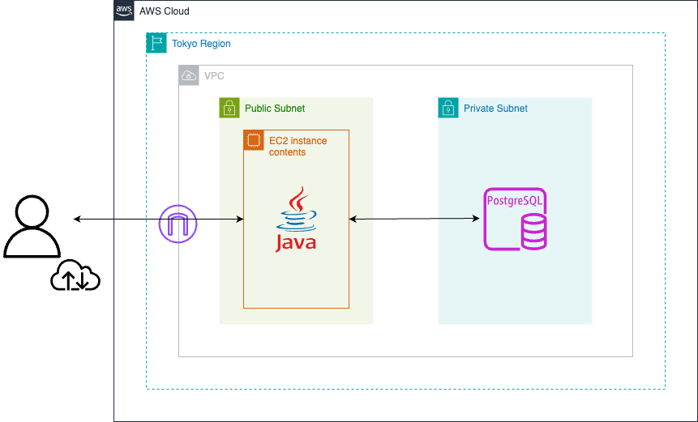

# レッスン記録アプリ

## 本アプリでの対応範囲
- 要件定義
- **`設計書作成`**
- **`モック作成`**
- **`DB構築`**
- **`バックエンド実装`**
- **`フロントエンド実装`**
- **`コンテナ構築`**
- **`単体テスト`**
- **`結合テスト`**
- **`クラウドサービス(本番環境)にデプロイ`**
- **`システムテスト`**

## 概要
学生時代に音楽サークルに在籍し若い学年の方への指導もしていた経験を思い出し、いつ誰にどういった指導をしたかをCRUD形式で記録することを想定したアプリケーションとなります。

**前社で行なっていた設計からシステムテストまでの一連のプロセスを一人称でゼロから再現し、ポートフォリオとして構築しました。**

## 技術スタック
### 使用技術
#### フロントエンド
- HTML
- CSS

#### バックエンド
- Java 21
- Spring Boot 3.4.1

    選定理由：実務経験のあるフレームワークでCRUDを実装することでバックエンドの実装能力を拡張するため

#### DB
- PostgreSQL 14.15

    選定理由：中長期的により規模の大きなデータを扱うのを見据えこの段階から基本的な構文に慣れるため

#### OS
- macOS
- Amazon Linux 2023(EC2インスタンス)

    選定理由：AWSの無料利用枠の中からなるべく新しいバージョンで対応できるようにするため

#### インフラ管理
- Docker 20.10.12

    導入理由(アプリ側)：ソースコードをDBから独立させつつ、デプロイ時にjarファイルを効率よく出力させるため

    導入理由(DB側)：他のDB環境との競合を避けつつ、アプリ側がAWS上のRDSへとスムーズに切り替えられるようにするため

#### クラウド
- AWS

    導入理由：基礎知識の確認をしつつ、本アプリを通してデプロイできるところまで拡張させるため

#### コードエディター
- Visual Studio Code

    選定理由：今後Java以外の言語を用いて開発することを見据えEclipse以外の環境を通して実装できるようにするため

## 主な機能
- アプリケーション立ち上げ時のログイン機能

- DBにあるレッスン記録の表示をはじめとするCRUD機能

下記の動画は実際にアプリケーションを動かしている様子です。

画面録画の都合でレコード削除での確認ダイアログが非表示となっていますが、[単体テスト](./docs/unit-test/unit-tests/no15.md)にてきちんと表示されることは確認済みです。

[](https://www.youtube.com/watch?v=oaYXNaPVrBQ)

各機能の詳細は"lesson-assumed-app/docs/各画面設計書(login.md,home.md,create.md,read.md,update.md)"を参照してください。

## コンテナからの起動方法
1. 使用しているOSにてDockerをインストールの上、[DBセットアップ説明書](./docs/db-schema/db-setup.md)に沿ってDBを立ち上げてください。

2. その後本リポジトリをcloneし、DBと同じく以下のコマンドを実行してください。
```
docker-compose build # 作り直す必要がなければ初回以降の実行は不要
docker-compose up -d
```

その後下記のリンクをChromeより開くことでアプリを起動できます。

http://localhost:8080

3. 停止する際はDBのコンテナとアプリのコンテナそれぞれで下記のコマンドを実行してください。
```
docker-compose down
```

## デプロイ概要
### 構成図



### デプロイ手順

#### ローカル開発
- Java + Spring Bootで本アプリを開発
- PostgreSQLはDockerのコンテナ上で作成しアプリと接続させる
- 単体テストと結合テストにあたるテストを行なった後にアプリもコンテナ化させる

#### AWS環境構築
- シングルAZ構成でパブリックサブネットとプライベートサブネットを作成
- プライベートサブネットにRDS(PostgreSQL)を配置し、パブリックサブネットからのアクセスを許可
- パブリックサブネットにEC2インスタンスを構築し、Java環境を整備しつつコンテナ化させたアプリをJarファイルで転送

#### 接続・動作確認
- psqlなどを用いてEC2からRDSに接続できることを確認
- ブラウザでアプリが起動されることを確認
- ローカルで開発していた時と同じように動作するかシステムテストを実施

### [リンク先](http://52.199.89.153:8080/)
- ユーザーID:lessonList
- パスワード:confirming

## 工夫した点
1. 現場で必要とされる機能を実装できるようにするため、CRUDの機能だけでなくログイン機能の実装も行いました。
2. アプリの性質上UIがシンプルになってしまうので、データの操作に直接関係するボタンに色を付けることでユーザーが行いたい処理をするにはどれを押下すればよいか直感的にわかるようにしました。
3. 下記のディレクトリで画面設計書、DB項目定義書、単体テスト仕様書、システムテスト仕様書等をマークダウン形式でゼロから作成することでなるべく現場に即したテスト工程を踏めるようにしました。(単体テスト内でDBとの接続のような結合テストにあたるテストを実施しているので結合テストとしてのドキュメント作成や実施は省略しています)

```
lesson-assumed-app/
    ├── docs/
    │   ├── db-schema/
    │   │   ├── DBセットアップ説明書(db-setup.md)
    │   │   └── DB項目定義書(db.md)
    │   ├── screen-design/
    │   │   ├── images/
    │   │   └── ページ毎の画面設計書(noX.md)
    │   ├── unit-test/
    │   │   ├── images/
    │   │   ├── unit-tests/
    │   │   │   └── 単体テスト仕様書(login.md,home.md,create.md,read.md,update.md)
    │   │   └── 単体テスト一覧表(UNITLIST.md)
    │   └── system-test/
    │       ├── images/
    │       ├── システムテスト仕様書(scenario.md)
    │       └── システムテスト実施結果(result.md)
    └── src/
        └── 本アプリケーションに関するソースコード
```

## 今後の課題
### フロントエンドの実装能力を拡張
- JavaScriptやそれを用いたフレームワークを習得し、アプリに動的な機能を持たせられるようにすることが課題であると考えています。

### 多様なシステム構成への対応
- 今回はEC2とRDS間でのデータのやり取りが中心だったので、より複雑なシステム構成にも対応できるようにすることが課題であると考えています。

### テストやデプロイ作業の効率化
- CI/CDやIaCを導入することでテストやデプロイ作業を効率化させるだけでなく、複数人でプロジェクトを動かすことになっても属人化を避けられるようにすることが課題であると考えています。