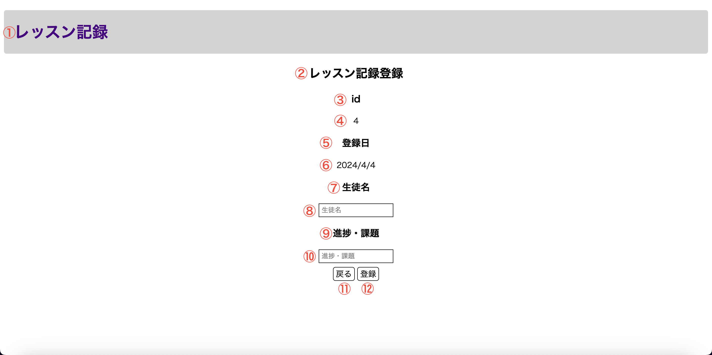

# 画面設計書(レッスン記録登録画面)

## 画面の目的
DBのテーブル"history"にid,登録日、生徒名、進捗・課題を登録することです。

## 画面の遷移方法
レッスン記録画面で登録ボタンを押下することです。

## 表示画面
以下はレッスン記録を登録する画面のモック画像です。

## 画面構成要素
1. アプリケーション名

    アプリケーション名「レッスン記録」を文字列で表示します。

2. 画面タイトル

    画面タイトル「レッスン記録登録」を文字列で表示します。

3. ID

    文字列「id」を見出しで表示します。

4. 取得したID

    DBよりテーブル"history"にある"id"の最も大きい数に1を足した数字を文字列で表示します。

5. 登録日

    文字列「登録日」を見出しで表示します。

6. 取得した登録日

    このページを開いた日付を文字列で表示します。

7. 生徒名

    文字列「生徒名」を見出しで表示します。

8. 生徒名入力欄

    生徒名を入力するためのテキストボックスです。(最大文字数10で必須入力とする)

    ユーザー側が入力する前はデフォルトで文字列「生徒名」を表示します。

9. 進捗・課題

    文字列「進捗・課題」を見出しで表示します。

10. 進捗・課題入力欄

    進捗・課題を入力するためのテキストボックスです。(最大文字数200で必須入力とする)

    ユーザー側が入力する前はデフォルトで文字列「進捗・課題」を表示します。

11. 戻るボタン

    押下した際に記録一覧画面へ遷移します。

12. 登録ボタン

    押下した際に4,6,8,10をDBのテーブル"history"に追加の上記録一覧画面へ遷移します。

## アクション設計
| No   | アクション名 | アクション詳細 |
| --- | ----------- | ------- |
| 1 | 初期表示 | レッスン記録画面から遷移したタイミングで画面構成要素より1~12を表示します。 4には下記の取得式で取得したものを反映させます。 取得式：SELECT MAX(id) + 1 FROM history; |
| 2 | 記録画面遷移 | 画面構成要素より11を押下した際にレッスン記録画面へ遷移します。 |
| 3 | 記録登録処理 | 画面構成要素より12を押下した際にレッスン記録編集画面へ遷移します。   登録処理では下記の挿入式を実行します。 挿入式：INSERT INTO history (lessonDate, studentName, lessonMemo) VALUES(6, 8, 10);|