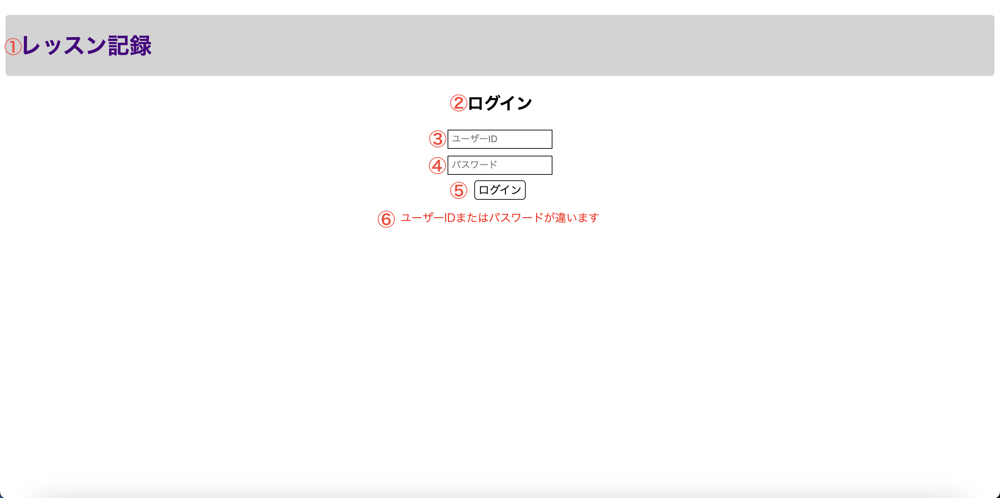

# 画面設計書(ログイン画面)

## 画面の目的
ユーザーIDとパスワードを入力した後ログインボタンを押下し、その組み合わせがDBよりテーブル"users"に登録されているものと合致している場合のみ記録一覧画面へ遷移させることです。

## 画面の遷移方法
このアプリケーションを起動し、ページを開いた際に一番最初に表示されます。

## 表示画面
以下はユーザーがログイン情報を入力する画面のモック画像です。

## 画面構成要素
1. アプリケーション名

    アプリケーション名「レッスン記録」を文字列で表示します。

2. 画面タイトル

    画面タイトル「ログイン」を文字列で表示します。

3. ユーザーID入力欄

    ユーザーIDを入力するためのテキストボックスです。(最大文字数10で必須入力とする)

    ユーザー側が入力する前はデフォルトで文字列「ユーザーID」を表示します。

4. パスワード入力欄

    ユーザーIDに対応するパスワードを入力するためのテキストボックスです。(最大文字数10で必須入力とする)

    ユーザー側が入力する前はデフォルトで文字列「パスワード」を表示します。

    入力した文字列は黒丸で表示されます。

5. ログインボタン

    ログイン画面から記録一覧画面へ遷移するために押下するボタンです。

    押下時に入力してあるユーザーIDとパスワードの組み合わせを取得し、DBよりテーブル"users"に合致する行が存在する場合のみ記録一覧画面へ遷移します。

6. エラーメッセージ

    押下時に入力してあるユーザーIDとパスワードの組み合わせを取得し、DBよりテーブル"users"に合致する行が存在しなかった場合のみ文字列を表示します。

## アクション設計
| No   | アクション名 | アクション詳細 |
| --- | ----------- | ------- |
| 1    | 初期表示 | アプリケーションを起動しページを開いた際に、画面構成要素より1から5までを表示します。 |
| 2    | 認証処理 | ログインボタンを押下した際に、各テキストボックスに入力されているユーザーIDとパスワードを取得します。  取得式：SELECT COUNT(id) FROM users WHERE userId = 取得したユーザーID AND confirmWord = 取得したパスワード;   以後この取得式で取得したidの件数を「取得件数」と表記します。|
| 3    | 画面遷移 | 取得件数 ≠ 0の場合、記録一覧画面へ遷移します。 |
| 4    | 認証エラー | 取得件数 = 0の場合、画面構成要素より6を表示します。 |