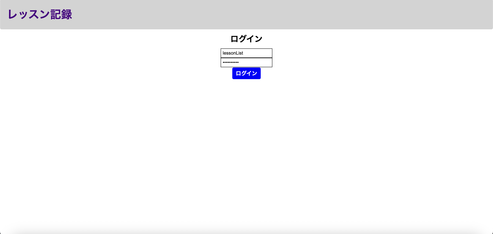
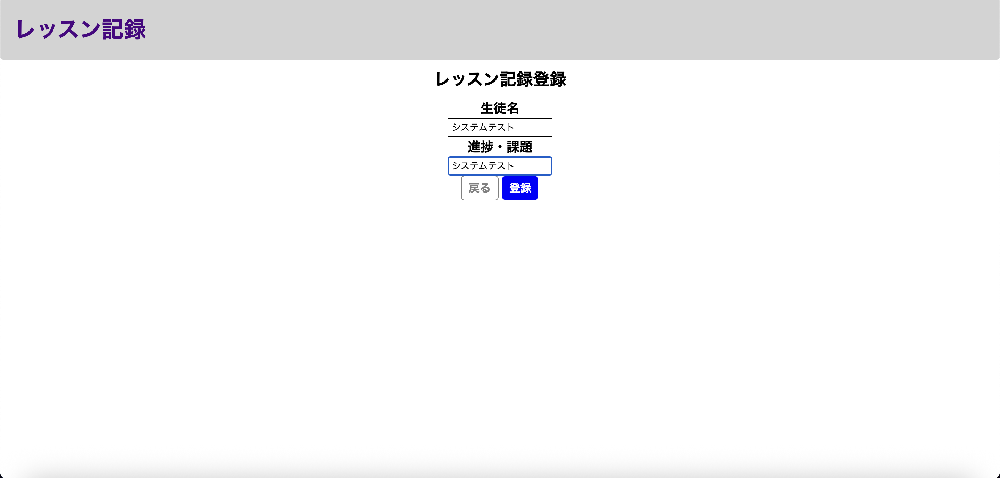
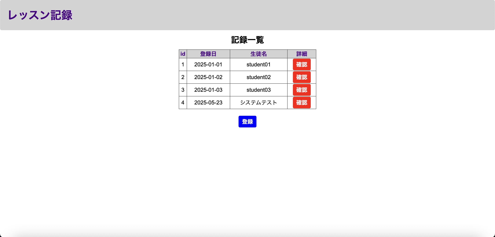
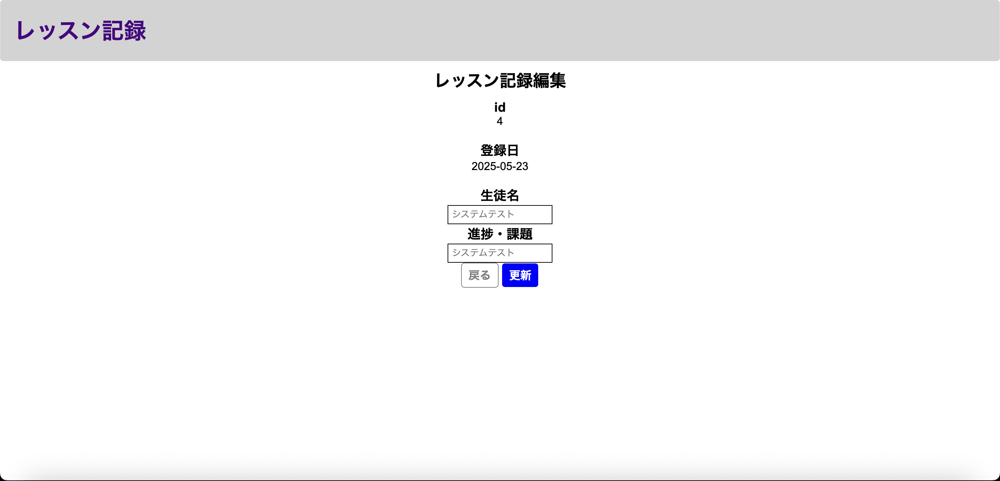
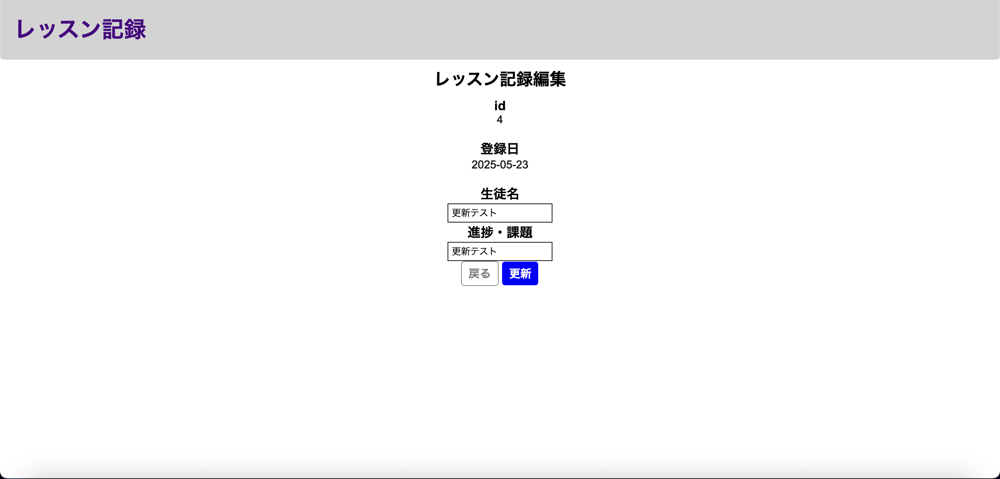
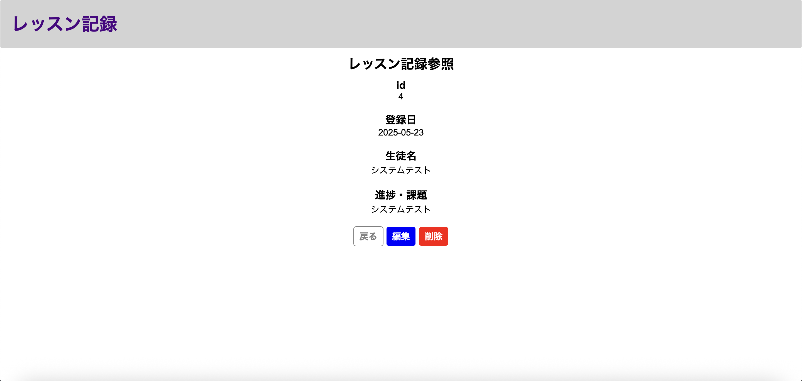
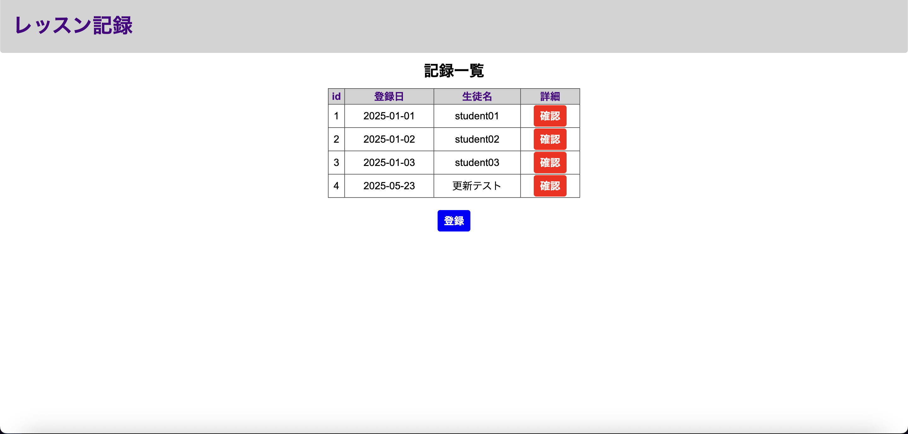
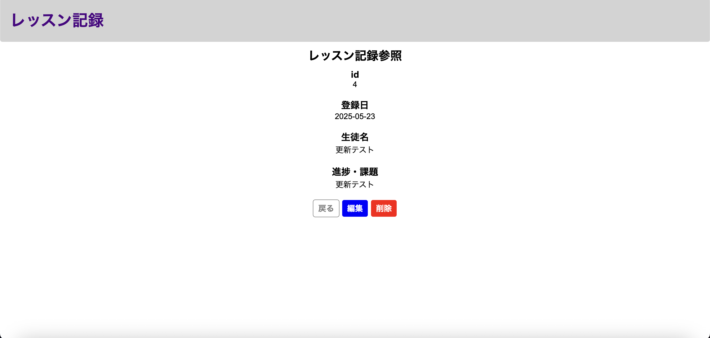
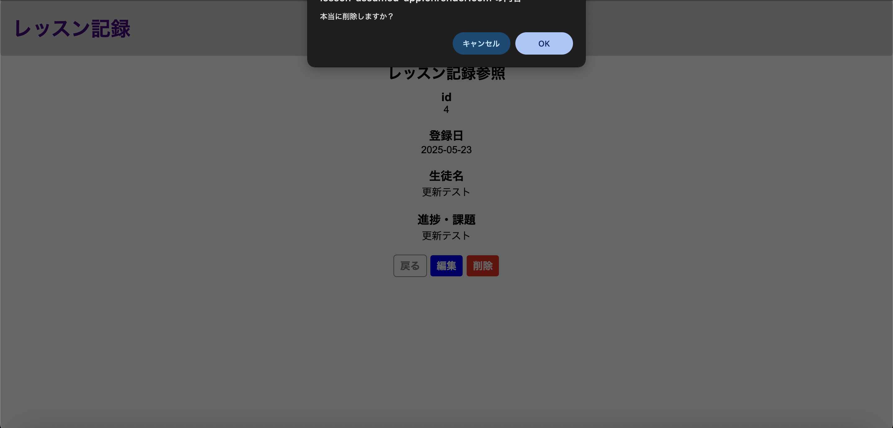
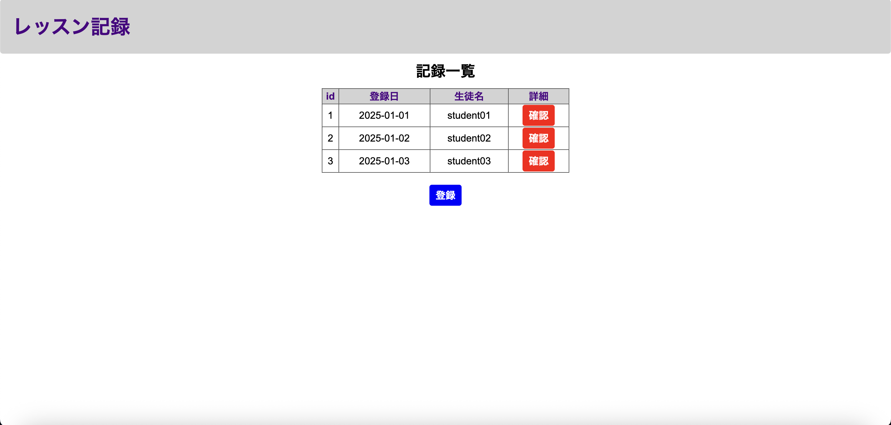

# システムテスト実施結果
## 前提条件
### DB
usersテーブル
| id | userId | confirmWord |
| --- | ----------- | ------- |
| 1 | lessonList | confirming |

historyテーブル
| id | lessonDate | studentName | lessonMemo |
| --- | ----------- | ------- | ------- |
| 1	| 2025-01-01 | test01 | testMemo01 |
| 2 | 2025-01-02 | test02 | testMemo02 |
| 3	| 2025-01-03 | test03 | testMemo03 |

## 実施シナリオ
1. ログイン画面にてusersテーブルにあるユーザーIDとパスワードを入力しログインボタンを押下する。

2. レッスン記録一覧画面にて表示項目がhistoryテーブルに沿っていることを確認する。

3. 登録ボタンを押下し、遷移先の登録画面で下記の通り入力する。

4. 登録ボタンを押下し、遷移先の画面で手順3にて入力した内容が行として追加されていることを確認する。

5. historyテーブル確認結果

historyテーブル
| id | lessonDate | studentName | lessonMemo |
| --- | ----------- | ------- | ------- |
  1 | 2025-01-01 | student01      | memo01|
  2 | 2025-01-02 | student02      | memo02|
  3 | 2025-01-03 | student03      | memo03|
  4 | 2025-05-23 | システムテスト | システムテスト|

6. 手順4で登録した行の確認ボタンを押下し、表示内容がhistoryテーブルと合致していることを確認する。

7. 戻るボタンを押下し、手順4と同じ表示になっていることを確認する。

8. 手順6を再度実施し、遷移先の画面で編集ボタンを押下し下記の画面に遷移することを確認する。

9. 生徒名、進捗・課題の各入力欄にそれぞれ「更新テスト」と入力する。

10. 戻るボタンを押下し、手順6の画面に戻っていることを確認する。

11. 編集ボタンの押下と手順9を再度行い、更新ボタンを押下した後トップ画面に遷移し生徒名が更新されていることを確認する。

12. historyテーブルの確認結果

historyテーブル
| id | lessonDate | studentName | lessonMemo |
| --- | ----------- | ------- | ------- |
  1 | 2025-01-01 | student01   | memo01 |
  2 | 2025-01-02 | student02   | memo02 |
  3 | 2025-01-03 | student03   | memo03 |
  4 | 2025-05-23 | 更新テスト | 更新テスト

13. 手順11で登録した行の確認ボタンを押下し、表示内容がhistoryテーブルと合致していることを確認する。

14. 削除ボタンを押下し、確認ダイアログに対し「OK」を押下する。(EC2パブリックIPは黒で対応)

15. トップ画面に遷移し、手順14で削除した行が表示されてないことを確認する。

16. historyテーブルの確認結果

historyテーブル
| id | lessonDate | studentName | lessonMemo |
| --- | ----------- | ------- | ------- |
  1 | 2025-01-01 | student01   | memo01|
  2 | 2025-01-02 | student02   | memo02|
  3 | 2025-01-03 | student03   | memo03|