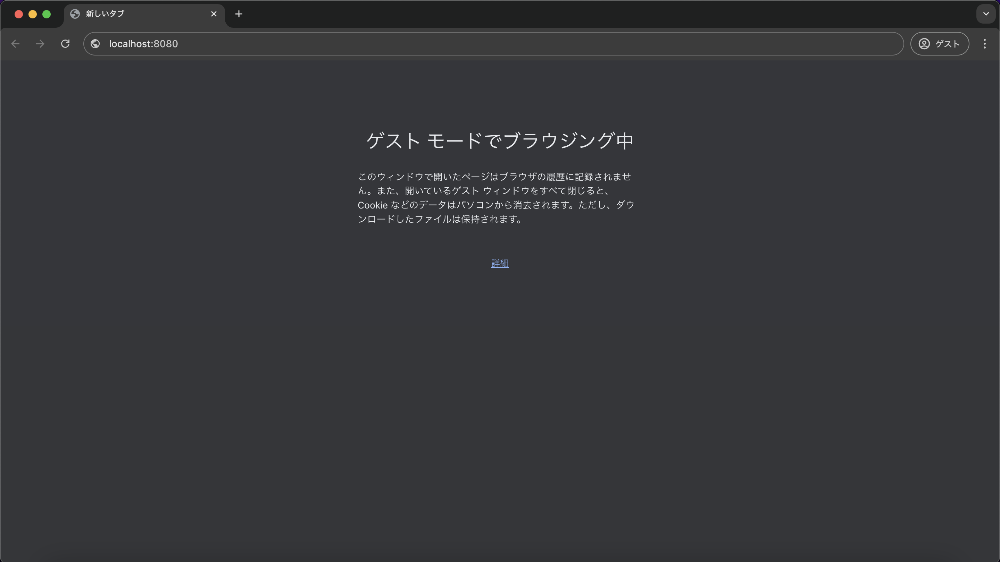

# 単体テスト仕様書

## 実施項目
| No   | 画面 | テスト処理 | 前提条件 | 操作手順 | 期待結果 | 実施結果 |
| --- | ----------- | ------- | ------- | ------- | ------- | ------- |
| 1 | ログイン画面 | 初期表示 | なし | アプリケーションを立ち上げlocalhost:8080を表示 | ログイン画面が立ち上がり画面設計書の画面構成要素の1から5までが表示されること | OK |

## 画面設計書のモック画像
ログイン画面

## テスト実施

| id | userId | confirmWord |
| --- | ----------- | ------- |
| 1 | lessonList | confirming |

### ブラウザのURL欄にlocalhost:8080を入力

### localhost:8080を表示
画面設計書のモック画像にて1~5まで合致
