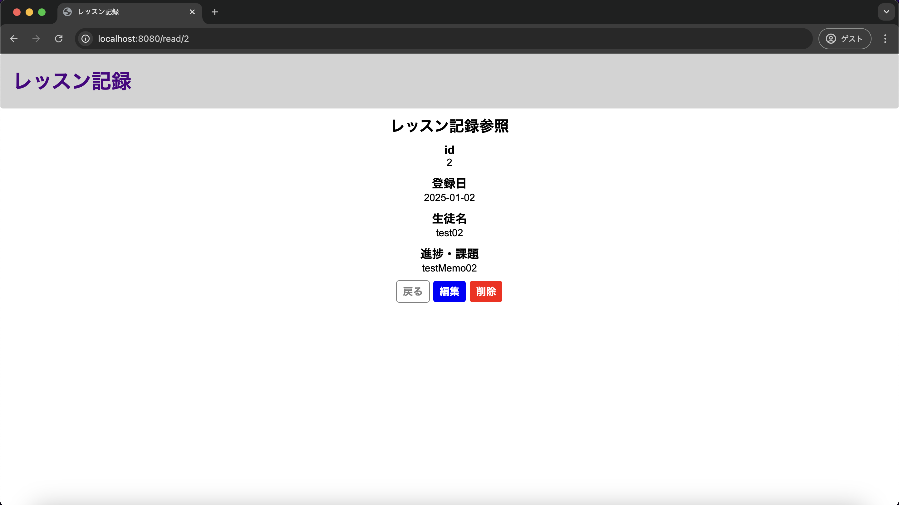

# 単体テスト仕様書

## 単体テスト項目一覧表
| No   | 画面 | テスト処理 | 前提条件 | 操作手順 | 期待結果 | 実施結果 |
| --- | ----------- | ------- | ------- | ------- | ------- | ------- |
| 13 | レッスン記録参照画面 | 記録編集画面遷移 | historyテーブルに該当するレコードが存在すること | 画面設計書の画面構成要素の12を押下する | 画面設計書の画面構成要素の4,6,8,10に対応したレッスン記録編集画面へ遷移すること | OK |

## 画面設計書のモック画像
レッスン記録参照画面

レッスン記録編集画面

usersテーブル
| id | userId | confirmWord |
| --- | ----------- | ------- |
| 1 | lessonList | confirming |

historyテーブル
| id | lessonDate | studentName | lessonMemo |
| --- | ----------- | ------- | ------- |
| 2 | 2025-01-02 | test02 | testMemo02 |
| 3	| 2025-01-03 | test03 | testMemo03 |
| 4	| 2025-01-04 | 単体テスト26 | 単体テスト26 |

## テスト実施
### 編集ボタンを押下
このページはhistoryテーブルより下記を反映したもの
| id | lessonDate | studentName | lessonMemo |
| --- | ----------- | ------- | ------- |
| 2 | 2025-01-02 | test02 | testMemo02 |

### 実施結果
レッスン記録編集画面へ遷移
表示項目もモック画像の趣旨と合致
