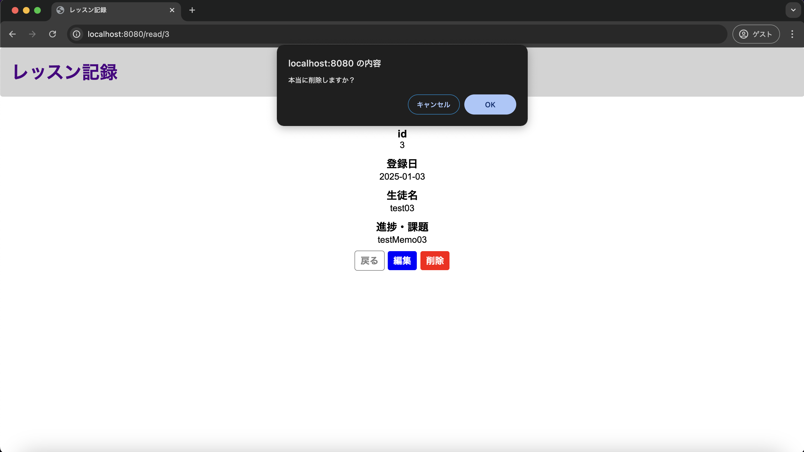

# 単体テスト仕様書

## 単体テスト項目一覧表
| No   | 画面 | テスト処理 | 前提条件 | 操作手順 | 期待結果 | 実施結果 |
| --- | ----------- | ------- | ------- | ------- | ------- | ------- |
| 15 | レッスン記録参照画面 | レコード削除 | historyテーブルに該当するレコードが存在すること | 1.画面設計書の画面構成要素の13を押下する 2.表示されたダイアログに「はい」を押下する | 1.レッスン記録一覧画面に遷移すること 2.historyテーブルに該当するレコードが削除されていること | OK |

## 画面設計書のモック画像
レッスン記録一覧画面

レッスン記録参照画面

usersテーブル
| id | userId | confirmWord |
| --- | ----------- | ------- |
| 1 | lessonList | confirming |

historyテーブル
| id | lessonDate | studentName | lessonMemo |
| --- | ----------- | ------- | ------- |
| 2 | 2025-01-02 | 単体テスト20 | 単体テスト20 |
| 3	| 2025-01-03 | test03 | testMemo03 |
| 4	| 2025-01-04 | 単体テスト26 | 単体テスト26 |

## テスト実施
### historyテーブルのid=3のページで削除ボタンを押下

### 実施結果
DBとレッスン記録一覧画面ともに更新されていることを確認

historyテーブル
| id | lessonDate | studentName | lessonMemo |
| --- | ----------- | ------- | ------- |
| 2 | 2025-01-02 | 単体テスト20 | 単体テスト20 |
| 4	| 2025-01-04 | 単体テスト26 | 単体テスト26 |

