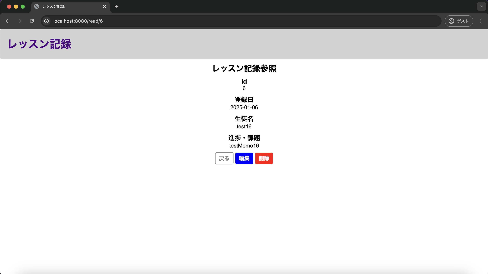
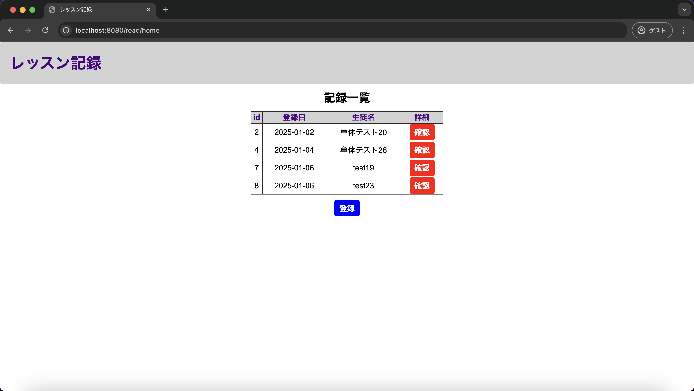

# 単体テスト仕様書

## 単体テスト項目一覧表
| No   | 画面 | テスト処理 | 前提条件 | 操作手順 | 期待結果 | 実施結果 |
| --- | ----------- | ------- | ------- | ------- | ------- | ------- |
| 16 | レッスン記録参照画面 | レコード削除・例外処理 | historyテーブルに該当するレコードが存在すること | 1.historyテーブルで該当するレコードを削除する 2.画面設計書の画面構成要素の13を押下する 3.表示されたダイアログに「はい」を押下する | レッスン記録一覧画面に遷移すること | OK |

## 画面設計書のモック画像
レッスン記録一覧画面

レッスン記録参照画面

usersテーブル
| id | userId | confirmWord |
| --- | ----------- | ------- |
| 1 | lessonList | confirming |

historyテーブル
| id | lessonDate | studentName | lessonMemo |
| --- | ----------- | ------- | ------- |
| 2 | 2025-01-02 | test02 | testMemo02 |
| 4	| 2025-01-04 | 単体テスト26 | 単体テスト26 |
| 6 | 2025-01-06 | test16 | testMemo16 |
| 7 | 2025-01-06 | test19 | testMemo19 |
| 8 | 2025-01-06 | test23 | testMemo23 |

## テスト実施
### レッスン記録一覧画面(テスト実施前)

### レコード削除の上削除ボタンとダイアログでのはいを押下
IDが6に該当するレッスン記録参照画面で実施

historyテーブル
| id | lessonDate | studentName | lessonMemo |
| --- | ----------- | ------- | ------- |
| 2 | 2025-01-02 | test02 | testMemo02 |
| 4	| 2025-01-04 | 単体テスト26 | 単体テスト26 |
| 7 | 2025-01-06 | test19 | testMemo19 |
| 8 | 2025-01-06 | test23 | testMemo23 |

### 実施結果
レッスン記録一覧画面へ遷移

