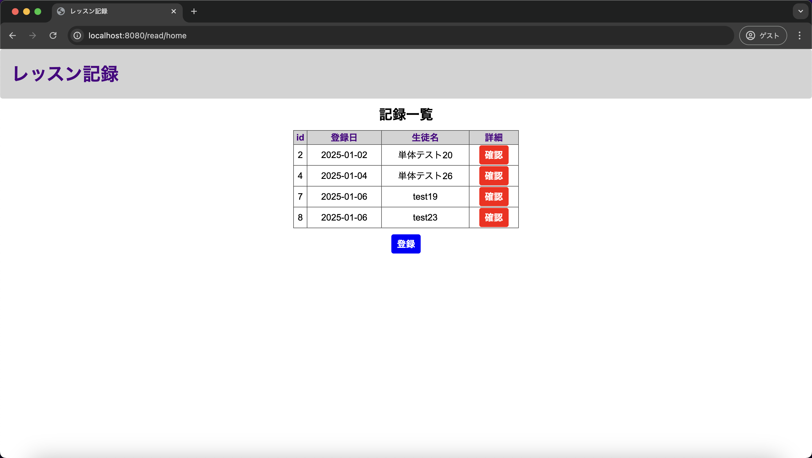
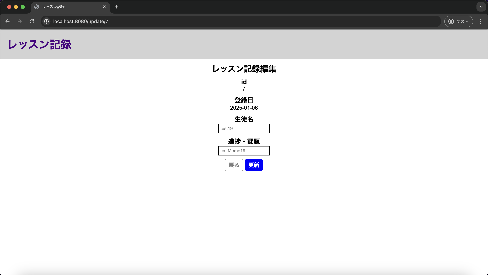
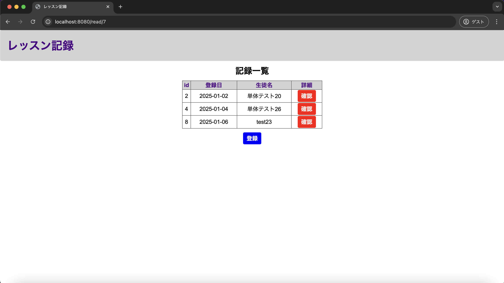

# 単体テスト仕様書

## 単体テスト項目一覧表
| No   | 画面 | テスト処理 | 前提条件 | 操作手順 | 期待結果 | 実施結果 |
| --- | ----------- | ------- | ------- | ------- | ------- | ------- |
| 19 | レッスン記録編集画面 | レッスン記録参照画面遷移・例外処理 | historyテーブルに該当するレコードが存在すること | 1.historyテーブルにて該当するレコードを削除 2.画面設計書の画面構成要素の11を押下 | レッスン記録一覧画面に再度遷移すること | OK |

## 画面設計書のモック画像
レッスン記録一覧画面

レッスン記録編集画面

usersテーブル
| id | userId | confirmWord |
| --- | ----------- | ------- |
| 1 | lessonList | confirming |

historyテーブル
| id | lessonDate | studentName | lessonMemo |
| --- | ----------- | ------- | ------- |
| 2 | 2025-01-02 | test02 | testMemo02 |
| 4	| 2025-01-04 | 単体テスト26 | 単体テスト26 |
| 7 | 2025-01-06 | test19 | testMemo19 |
| 8 | 2025-01-06 | test23 | testMemo23 |

## テスト実施
### レッスン記録一覧画面(テスト実施前)

### レコード削除の上戻るボタンを押下
IDが7に該当するレッスン記録編集画面で実施

historyテーブル
| id | lessonDate | studentName | lessonMemo |
| --- | ----------- | ------- | ------- |
| 2 | 2025-01-02 | test02 | testMemo02 |
| 4	| 2025-01-04 | 単体テスト26 | 単体テスト26 |
| 8 | 2025-01-06 | test23 | testMemo23 |

### 実施結果
IDが7に該当するレコードの表示がない状態でレッスン記録一覧画面へ遷移
