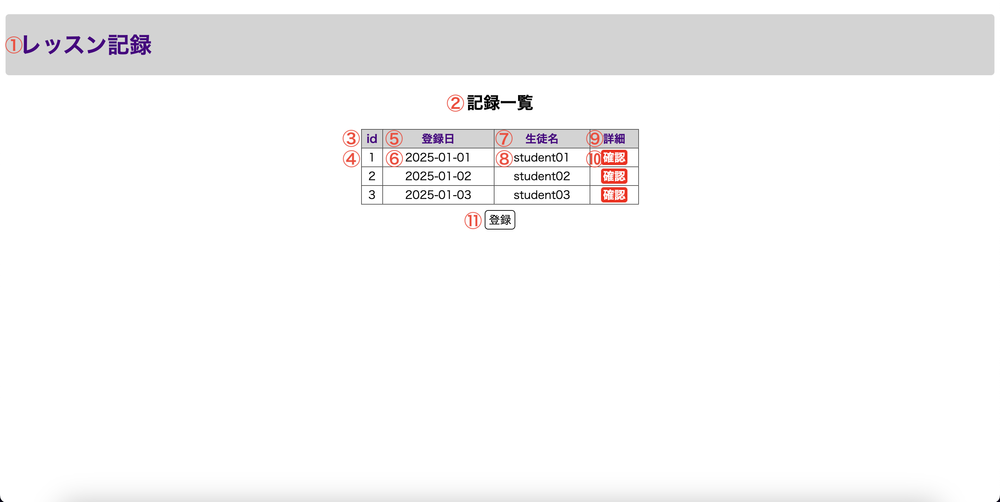
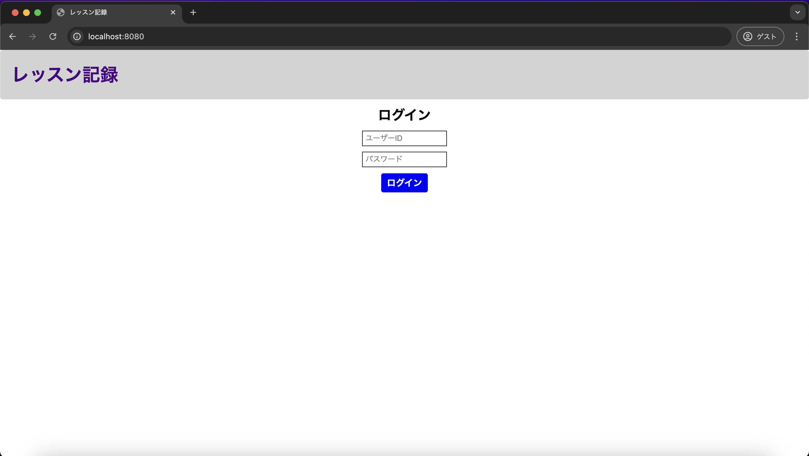
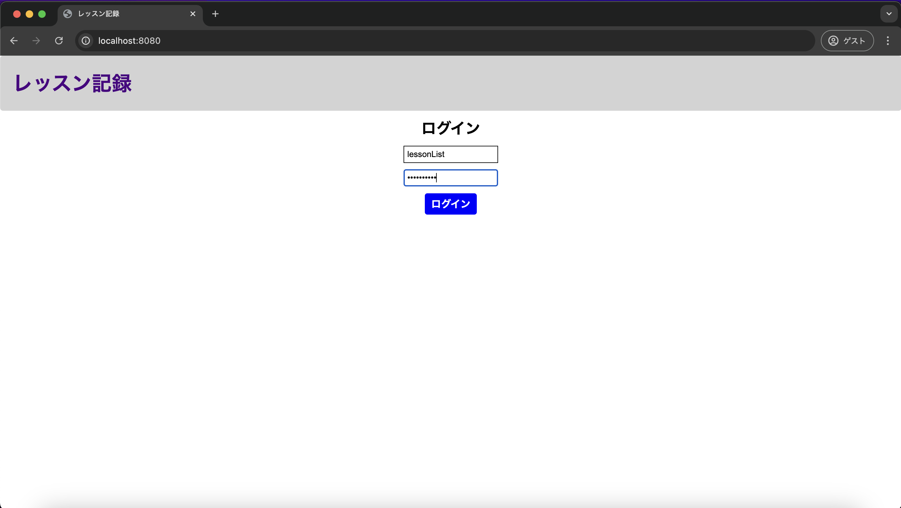
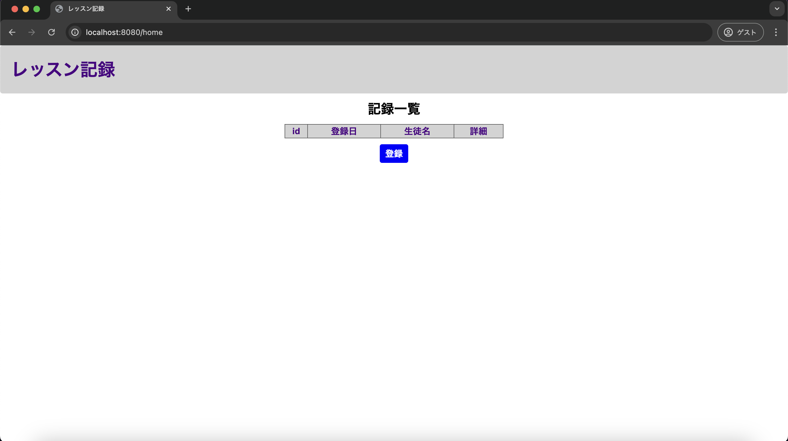

# 単体テスト仕様書

## 実施項目
| No   | 画面 | テスト処理 | 前提条件 | 操作手順 | 期待結果 | 実施結果 |
| --- | ----------- | ------- | ------- | ------- | ------- | ------- |
| 2 | ログイン画面 | 認証処理・画面遷移 | usersテーブルにレコードが存在すること | usersテーブルに存在するユーザーIDとパスワードを入力しログインボタンを押下する | レッスン記録一覧画面へ遷移すること | OK |

## 画面設計書のモック画像
ログイン画面

レッスン記録一覧画面

## テスト実施

### DB
usersテーブル
| id | userId | confirmWord |
| --- | ----------- | ------- |
| 1 | lessonList | confirming |

historyテーブル
| id | lessonDate | studentName | lessonMemo |
| --- | ----------- | ------- | ------- |

### usersテーブルに存在するユーザーIDとパスワードを入力

### 実施結果
レッスン記録一覧画面へ遷移
