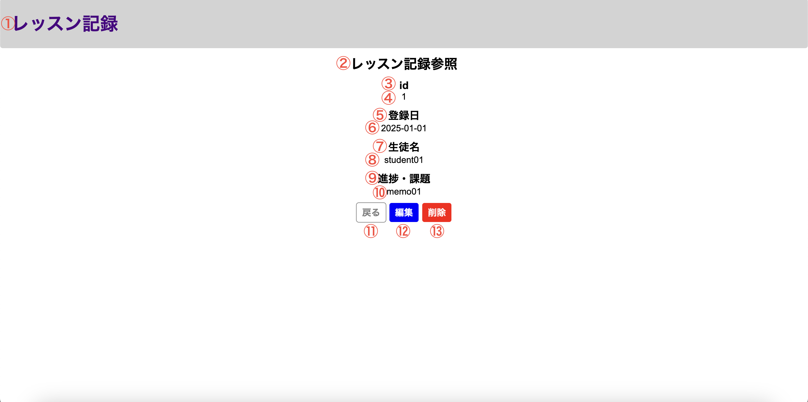
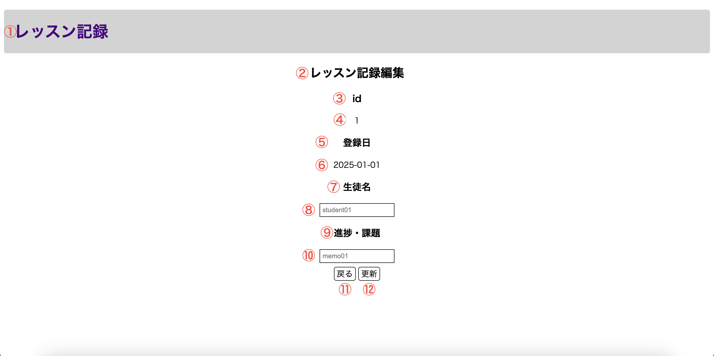
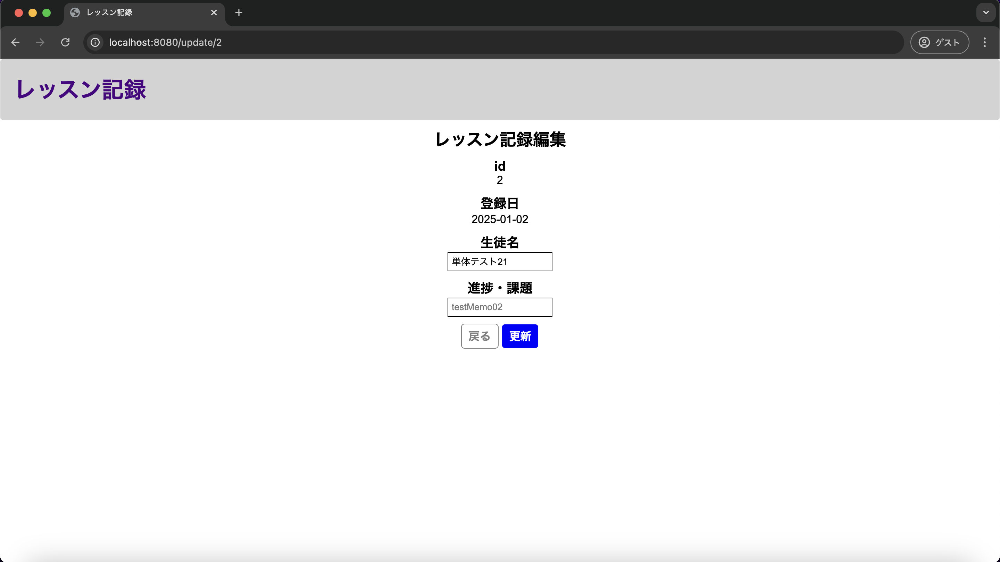
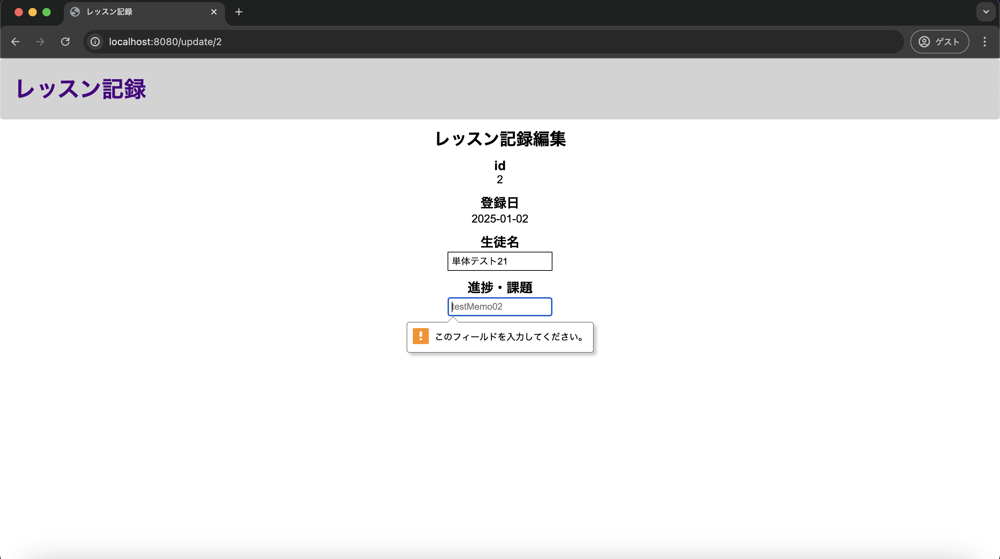
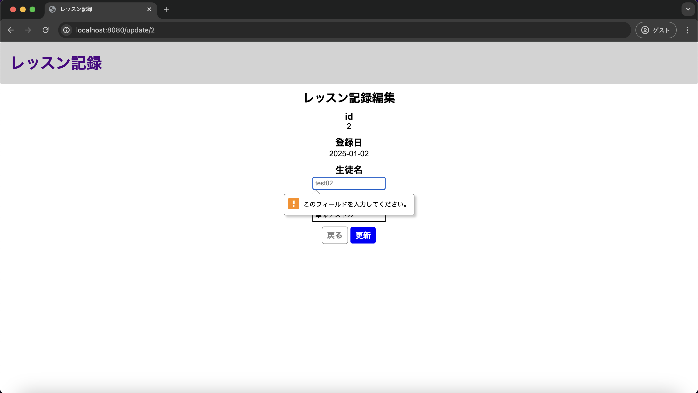

# 単体テスト仕様書

## 単体テスト項目一覧表
| No   | 画面 | テスト処理 | 前提条件 | 操作手順 | 期待結果 | 実施結果 |
| --- | ----------- | ------- | ------- | ------- | ------- | ------- |
| 21 | レッスン記録編集画面 | レコード更新・例外処理 | historyテーブルに該当するレコードが存在すること | 画面設計書の画面構成要素の8に適当な文字列を入力 2.画面設計書の画面構成要素の12を押下 | 画面設計書の画面構成要素の10への入力を求めるメッセージが表示されること | OK |
| 22 | レッスン記録編集画面 | レコード更新・例外処理 | historyテーブルに該当するレコードが存在すること | 画面設計書の画面構成要素の10に適当な文字列を入力 2.画面設計書の画面構成要素の12を押下 | 画面設計書の画面構成要素の8への入力を求めるメッセージが表示されること | OK |

## 画面設計書のモック画像
レッスン記録参照画面

レッスン記録編集画面

usersテーブル
| id | userId | confirmWord |
| --- | ----------- | ------- |
| 1 | lessonList | confirming |

historyテーブル
| id | lessonDate | studentName | lessonMemo |
| --- | ----------- | ------- | ------- |
| 2 | 2025-01-02 | test02 | testMemo02 |
| 3	| 2025-01-03 | test03 | testMemo03 |
| 4	| 2025-01-04 | 単体テスト26 | 単体テスト26 |

## テスト実施
historyテーブルのid=2のページを表示

### 生徒名のみ入力し更新ボタンを押下

### 実施結果

### 進捗・課題のみ入力し更新ボタンを押下

### 実施結果
