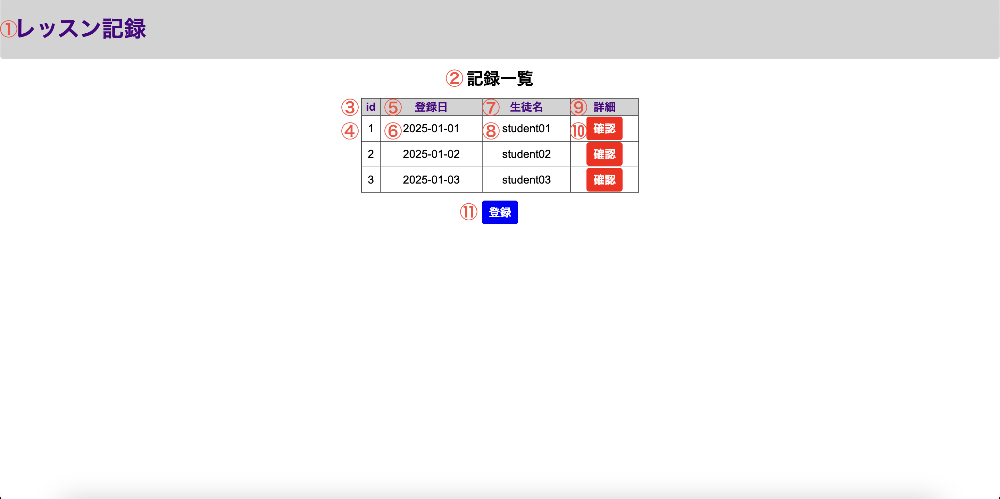
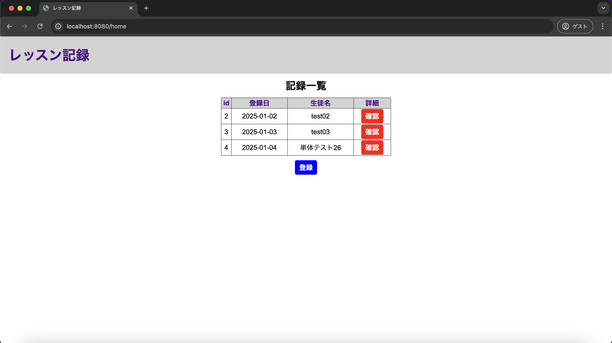

# 単体テスト仕様書

## 単体テスト項目一覧表
| No   | 画面 | テスト処理 | 前提条件 | 操作手順 | 期待結果 | 実施結果 |
| --- | ----------- | ------- | ------- | ------- | ------- | ------- |
| 26 | レッスン記録登録画面 | 記録登録 | なし | 画面設計書の画面構成要素の4,6を入力の上8を押下 | 1.レッスン記録一覧画面へ遷移すること 2.historyテーブルにレコードが追加され、登録した日付と画面構成要素の4,6が反映されていること | OK |

## 画面設計書のモック画像
レッスン記録一覧画面

レッスン記録登録画面

### DB
usersテーブル
| id | userId | confirmWord |
| --- | ----------- | ------- |
| 1 | lessonList | confirming |

historyテーブル
| id | lessonDate | studentName | lessonMemo |
| --- | ----------- | ------- | ------- |
| 2 | 2025-01-02 | test02 | testMemo02 |
| 3	| 2025-01-03 | test03 | testMemo03 |

## テスト実施
### 生徒名と進捗・課題を入力し、登録ボタンを押下

### 実施結果

historyテーブル
| id | lessonDate | studentName | lessonMemo |
| --- | ----------- | ------- | ------- |
| 2 | 2025-01-02 | test02 | testMemo02 |
| 3	| 2025-01-03 | test03 | testMemo03 |
| 4	| 2025-01-04 | 単体テスト26 | 単体テスト26 |
lessonDateは単体テスト実施日、生徒名とレッスンメモはレッスン記録登録画面で入力したものと合致