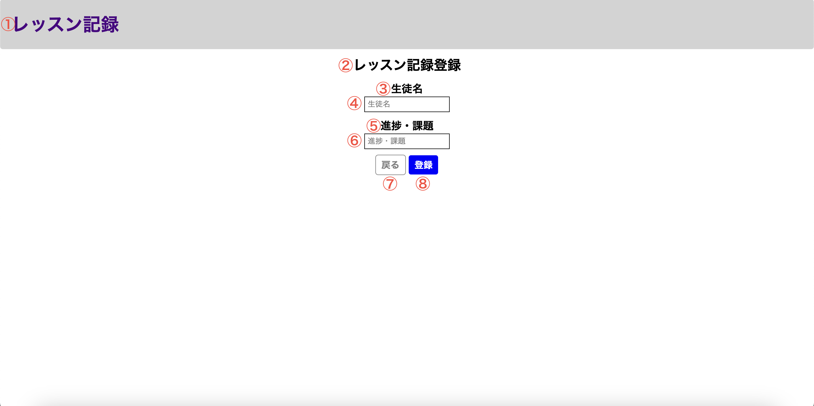

# 単体テスト仕様書

## 単体テスト項目一覧表
| No   | 画面 | テスト処理 | 前提条件 | 操作手順 | 期待結果 | 実施結果 |
| --- | ----------- | ------- | ------- | ------- | ------- | ------- |
| 27 | レッスン記録登録画面 | 記録登録 | なし | 画面設計書の画面構成要素の4を入力の上8を押下 | 画面設計書の画面構成要素の6への入力を求めるメッセージが表示されること | OK |
| 28 | レッスン記録登録画面 | 記録登録 | なし | 画面設計書の画面構成要素の6を入力の上8を押下 | 画面設計書の画面構成要素の4への入力を求めるメッセージが表示されること | OK |

## 画面設計書のモック画像
レッスン記録登録画面

### DB
usersテーブル
| id | userId | confirmWord |
| --- | ----------- | ------- |
| 1 | lessonList | confirming |

historyテーブル
| id | lessonDate | studentName | lessonMemo |
| --- | ----------- | ------- | ------- |
| 2 | 2025-01-02 | test02 | testMemo02 |
| 3	| 2025-01-03 | test03 | testMemo03 |
| 4	| 2025-01-04 | 単体テスト26 | 単体テスト26 |

## テスト実施
### 生徒名のみを入力

### 実施結果

### 進捗・課題のみを入力

### 実施結果

