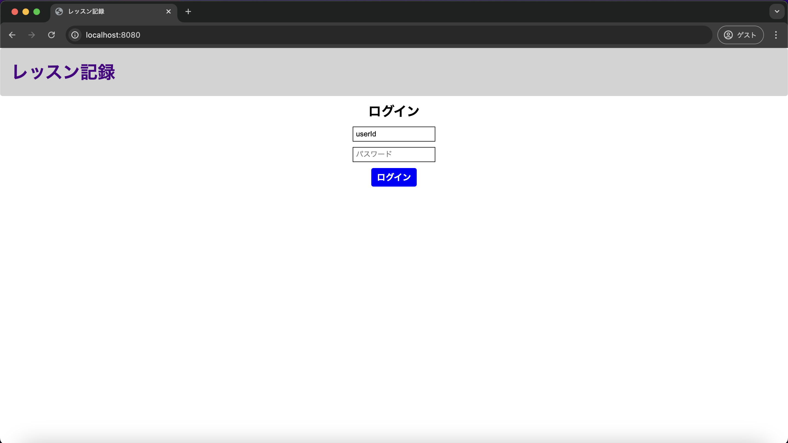
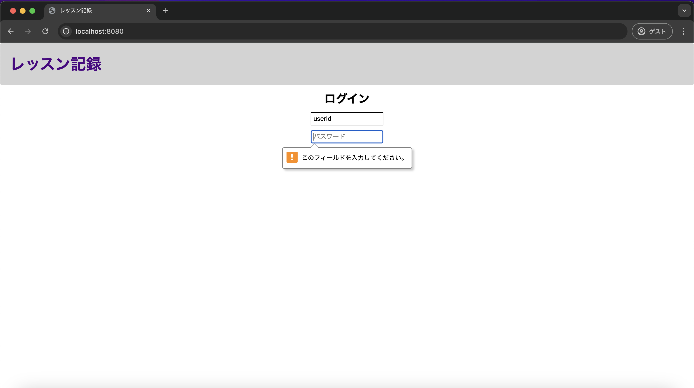
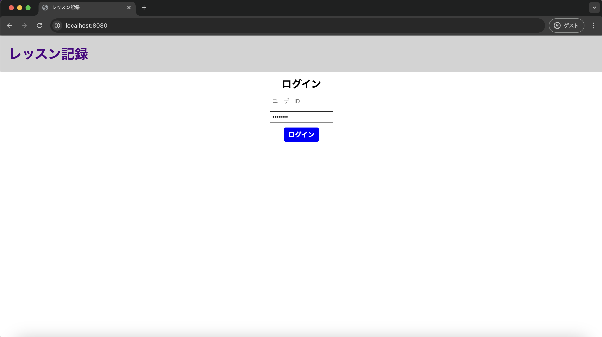
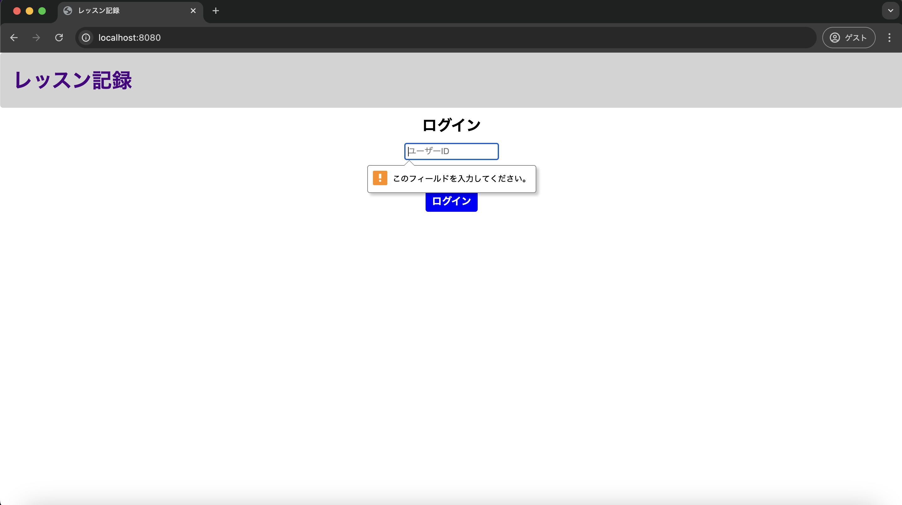

# 単体テスト仕様書

## 実施項目
| No   | 画面 | テスト処理 | 前提条件 | 操作手順 | 期待結果 | 実施結果 |
| --- | ----------- | ------- | ------- | ------- | ------- | ------- |
| 4 | ログイン画面 | 認証処理・例外処理 | usersテーブルにレコードが存在すること | ユーザーIDのみを入力しログインボタンを押下する | 画面遷移せず、パスワードの入力を求めるメッセージが表示されること | OK |
| 5 | ログイン画面 | 認証処理・例外処理 | usersテーブルにレコードが存在すること | パスワードのみを入力しログインボタンを押下する | 画面遷移せず、ユーザーIDの入力を求めるメッセージが表示されること | OK |

## 画面設計書のモック画像
ログイン画面

## テスト実施

### DB
usersテーブル
| id | userId | confirmWord |
| --- | ----------- | ------- |
| 1 | lessonList | confirming |

### ユーザーIDのみを入力しログインボタンを押下

### 表示結果

### パスワードのみを入力しログインボタンを押下

### 表示結果
