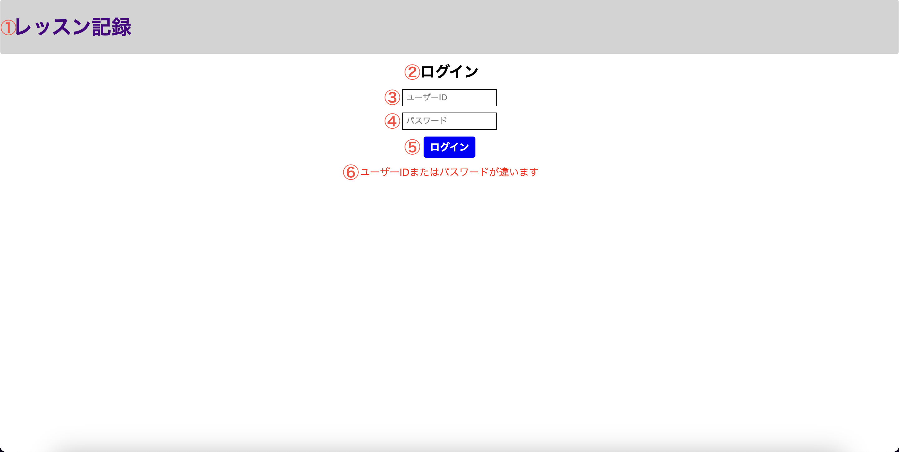

# 単体テスト仕様書

## 実施項目
| No   | 画面 | テスト処理 | 前提条件 | 操作手順 | 期待結果 | 実施結果 |
| --- | ----------- | ------- | ------- | ------- | ------- | ------- |
| 6 | レッスン記録一覧画面 | 初期表示 | historyテーブルにレコードが存在しないこと | ログイン画面からレッスン記録一覧画面へ遷移する | 画面設計書の画面構成要素の1,2,3,5,7,9,11が表示されること | OK |

## 画面設計書のモック画像
ログイン画面

レッスン記録一覧画面

## テスト実施

### DB
usersテーブル
| id | userId | confirmWord |
| --- | ----------- | ------- |
| 1 | lessonList | confirming |

historyテーブル
| id | lessonDate | studentName | lessonMemo |
| --- | ----------- | ------- | ------- |

### 表示結果
[単体テストNo.2](no2.md)で同条件での画面遷移を行なっているので実施不要