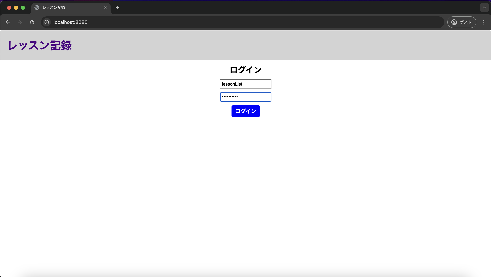
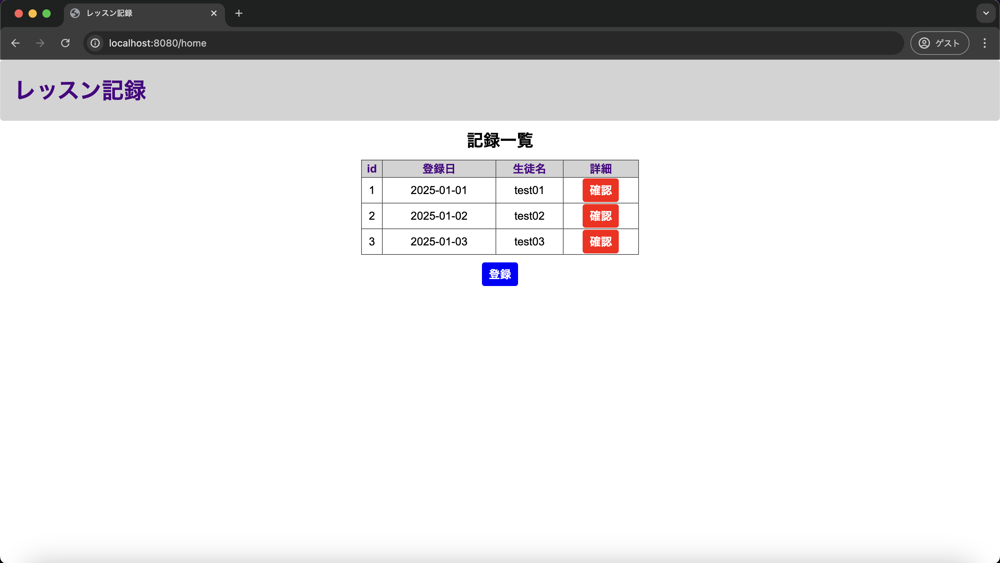

# 単体テスト仕様書

## 単体テスト項目一覧表
| No   | 画面 | テスト処理 | 前提条件 | 操作手順 | 期待結果 | 実施結果 |
| --- | ----------- | ------- | ------- | ------- | ------- | ------- |
| 7 | レッスン記録一覧画面 | 初期表示 | historyテーブルにレコードが存在すること | ログイン画面からレッスン記録一覧画面へ遷移する | 画面設計書の画面構成要素の1から11が表示されること | OK |

## 画面設計書のモック画像
ログイン画面

レッスン記録一覧画面

## テスト実施

### DB
usersテーブル
| id | userId | confirmWord |
| --- | ----------- | ------- |
| 1 | lessonList | confirming |

historyテーブル
| id | lessonDate | studentName | lessonMemo |
| --- | ----------- | ------- | ------- |
| 1	| 2025-01-01 | test01 | testMemo01 |
| 2 | 2025-01-02 | test02 | testMemo02 |
| 3	| 2025-01-03 | test03 | testMemo03 |

## テスト実施

### usersテーブルに存在するユーザーIDとパスワードを入力

### 実施結果
レッスン記録一覧画面へ遷移
