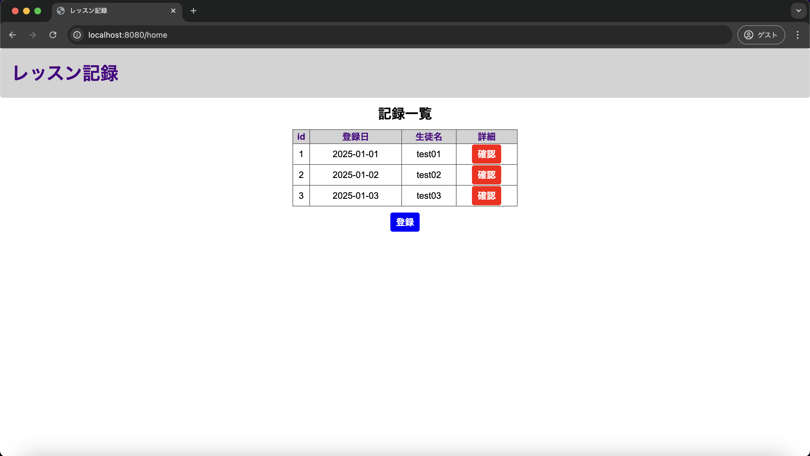
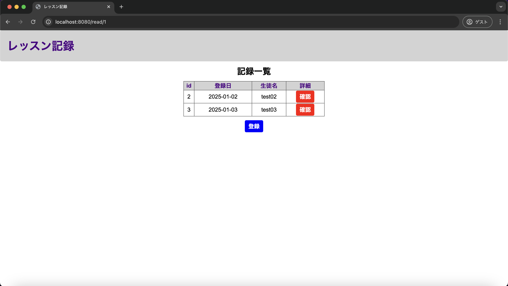

# 単体テスト仕様書

## 単体テスト項目一覧表
| No   | 画面 | テスト処理 | 前提条件 | 操作手順 | 期待結果 | 実施結果 |
| --- | ----------- | ------- | ------- | ------- | ------- | ------- |
| 9 | レッスン記録一覧画面 | 参照画面遷移・例外処理 | historyテーブルにレコードが存在すること | 1.historyテーブルにあるレコードを削除する 2.画面設計書の画面構成要素の10で削除したレコードのIDに対応するものを押下する | レッスン記録一覧画面に再度遷移すること | OK |

## 画面設計書のモック画像
レッスン記録一覧画面

レッスン記録参照画面

### DB
usersテーブル
| id | userId | confirmWord |
| --- | ----------- | ------- |
| 1 | lessonList | confirming |

historyテーブル
| id | lessonDate | studentName | lessonMemo |
| --- | ----------- | ------- | ------- |
| 1	| 2025-01-01 | test01 | testMemo01 |
| 2 | 2025-01-02 | test02 | testMemo02 |
| 3	| 2025-01-03 | test03 | testMemo03 |

## テスト実施
### historyテーブルからid=1のレコードを削除
| id | lessonDate | studentName | lessonMemo |
| --- | ----------- | ------- | ------- |
| 2 | 2025-01-02 | test02 | testMemo02 |
| 3	| 2025-01-03 | test03 | testMemo03 |

### idが1のレコードの確認ボタンを押下

### 表示結果
レッスン記録参照画面へ遷移せず、レッスン記録一覧画面へと遷移
